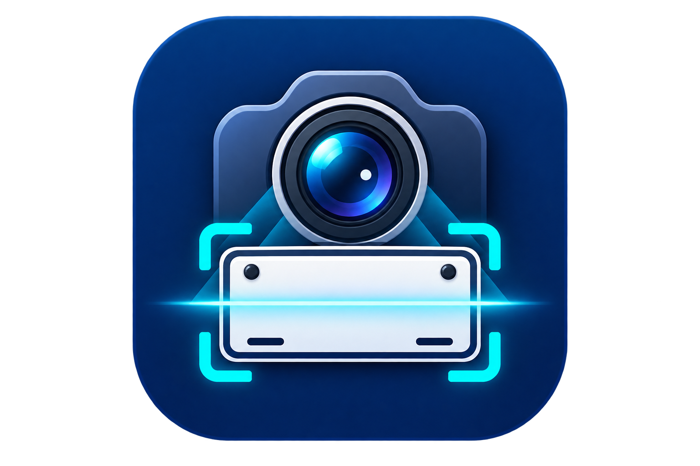

# CamerBound

  

CamerBound, ENTRY ve EXIT kameralarından araç plakalarını algılayıp giriş-çıkış kayıtlarını yerel olarak tutan Windows masaüstü uygulamasıdır.

## Windows için indir

[⬇️ CamerBound v1.0.0 — Windows Installer](https://github.com/muhammedcanarica/CamerBound/releases/latest/download/CamerBound_Setup.exe)

[📘 CamerBound v1.0 — Kullanım Kılavuzu](https://github.com/muhammedcanarica/CamerBound/releases/download/v1.0.0/CamerBound_Kullanim_Kilavuzu_v1.0.pdf)

Windows 10/11 x64 içindir. Python veya ek bir geliştirme ortamı kurulması gerekmez.

> Uygulama kod imzalama sertifikasıyla imzalanmadığı için Windows SmartScreen ilk çalıştırmada "Bilinmeyen yayıncı" uyarısı gösterebilir.

## Özellikler

- ENTRY ve EXIT kameraları için ayrı canlı görüntü
- RTSP/IP kamera, webcam ve yerel video desteği
- OpenVINO ile plaka algılama
- PaddleOCR tabanlı yerel OCR
- Türk plaka doğrulama
- Giriş ve çıkış kayıtları
- Araç fotoğrafı kaydı
- Plaka arama ve filtreleme
- ADMIN ve USER kullanıcı rolleri
- Kamera bazlı plaka alanı (ROI) kalibrasyonu
- OCR ve sistem tanılama ekranı
- Yerel SQLite veritabanı

## Kurulum

1. [CamerBound_Setup.exe](https://github.com/muhammedcanarica/CamerBound/releases/latest/download/CamerBound_Setup.exe) dosyasını indirin.
2. Kurulum dosyasını çalıştırın.
3. Kurulum tamamlandıktan sonra CamerBound'u Başlat menüsünden açın.

## İlk kullanım

1. ADMIN hesabıyla giriş yapın.
2. Ayarlar ekranından ENTRY ve EXIT kamera kaynaklarını tanımlayın.
3. Her kamera için plakanın geçeceği alanı ROI kalibrasyonuyla belirleyin.
4. Canlı görüntü üzerinden algılamayı kontrol edin; kayıtları Son Hareketler veya Kayıtlar ekranından inceleyin.

Ayrıntılı anlatım için [kullanım kılavuzunu indirin](https://github.com/muhammedcanarica/CamerBound/releases/download/v1.0.0/CamerBound_Kullanim_Kilavuzu_v1.0.pdf).

## Veriler ve gizlilik

Plaka kayıtları, araç fotoğrafları, kullanıcılar ve kamera ayarları uygulamanın kurulu olduğu bilgisayarda tutulur. Normal kullanım için bulut servisi gerekmez.

Gerçek plaka görsellerini, kamera kullanıcı bilgilerini veya saha veritabanlarını GitHub deposuna eklemeyin.

## Bilinen sınırlamalar

CamerBound, saha testinden geçmiş çalışan bir prototiptir; üretim seviyesinde `%100` plaka tanıma doğruluğu iddia etmez. Başarı oranı kamera açısı, araç hızı, ışık, yansıma, hareket bulanıklığı, plaka büyüklüğü ve görüntü kalitesine bağlıdır.

## Teknik bilgiler

- Platform: Windows 10/11 x64
- Arayüz: Python ve PySide6
- Plaka algılama: OpenVINO
- OCR: PaddleOCR
- Veritabanı: SQLite
- Çalışma biçimi: Yerel ve çevrimdışı

Üçüncü taraf kütüphane ve model lisansları [THIRD_PARTY_NOTICES.md](THIRD_PARTY_NOTICES.md) dosyasında yer alır.
